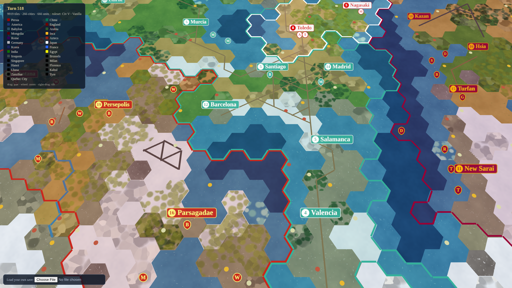
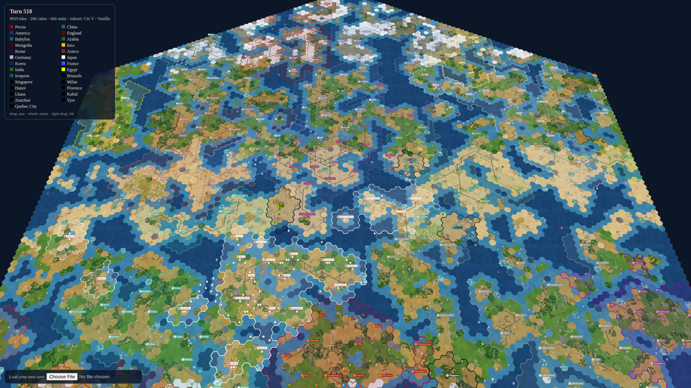

# Civ5-Look Renderer — POC

A web renderer that loads a **real Unciv save file** and draws its game state as a
static, pannable, Civ5-style map in three.js — **without touching the Unciv engine.**



The board above is not a demo fixture. It is an actual archived multiplayer game
(turn 518, 14 major civs + 28 city-states, 266 cities, 666 units, 9919 tiles)
parsed straight from Unciv's save wire format and drawn from truth.



## Run it

```bash
bun install
bun run dev        # http://127.0.0.1:5199 — loads the bundled real save
bun test           # 49 tests, most against the real save
bun run summary    # Phase 0 done-check: text summary of the save
```

Pan with drag, zoom with wheel, tilt with right-drag. Load any of your own
saves (`~/.local/share/Unciv/SaveFiles/…`) with the file picker.

## What proved out (the POC checklist)

| Phase | Deliverable | Where |
|---|---|---|
| 0 — Crack the data | `loadSave()` round-trips real saves: base64+gzip unwrap, **all three libGDX JSON dialects** (old saves are `OutputType.minimal` — unquoted keys *and* values) | `src/save/` |
| 0 — Ruleset | Name→definition resolver over vendored base rulesets (terrains, resources, improvements, nations→colors, units) with miss-tolerant reporting | `src/ruleset/` |
| 1 — Hex transform | **1:1 port of Unciv's `HexMath.kt`** (its own scheme: x = 10 o'clock, y = 2 o'clock, world = clock-vector combination). Tessellation invariants tested; 9919 tiles = exactly `getNumberOfTilesInHexagon(57)` | `src/hex/hex-math.ts` |
| 2 — Terrain | Data-driven `asset-map.json` → merged per-texture hex geometry with **world-space UVs** (same-terrain neighbours read as continuous ground). Features layered by z-hint | `src/render/` |
| 3 — Entities/borders | Cities & units as canvas-billboards in nation colors; territory from city `tiles` ownership; border edges where owner changes | `src/render/board-model.ts` |
| 4 — Camera | Pan / zoom-to-distance / tilt, URL-parameterized framing for reproducible screenshots | `src/render/camera-controls.ts` |

Everything three.js draws comes from `buildBoardModel()` — a pure, fully-tested
transformation. The renderer holds no game knowledge; the model holds no three.js.

## Texture pack: Artful Terrain Textures

The chosen reskin is Rajul's
[Artful Terrain Textures](https://forums.civfanatics.com/resources/artful-terrain-textures.30689/)
(Civ5 pseudo-DLC). CivFanatics sits behind a bot-check this environment can't
pass, so `public/textures/artful/*.png` currently holds **procedural stand-ins
generated under the pack's taxonomy** (`cli/generate-textures.ts`).

To swap in the real pack: convert its DDS terrain textures to PNG and drop them
over the same filenames (`grassland.png`, `plains.png`, `desert.png`,
`tundra.png`, `snow.png`, `mountain.png`, …). `src/render/asset-map.json` is the
single mapping point — **asset swapping is config, not code.**

## Docs

- [docs/SAVE_FORMAT.md](docs/SAVE_FORMAT.md) — the save wire format, the JSON
  dialects, the minimum `GameInfo` subset, and the provenance of the bundled
  real saves ([xlenstra/unciv-save-archive](https://github.com/xlenstra/unciv-save-archive)).

## Out of scope (by design)

Engine changes, turn advancement, input-to-engine commands, animation between
states, multiplayer transport, mod support beyond the base rulesets. This POC is
the foundation the playable version reuses: the parser, the hex transform, and
the asset mapping are built to last; the rest is deliberately minimal.

## Known gaps

- World-wrap maps render unwrapped (`getUnwrappedNearestTo` is ported and
  tested, not yet wired into placement).
- Fog of war / explored-tiles overlay not drawn (data is parsed and available).
- Unit billboards use initials, not model renders; city banners can crowd at
  full zoom-out.
- Very old saves with `terrainFeature` (singular) parse but haven't been
  exercised against a real specimen.
